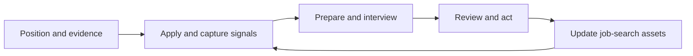

# 🚀 Career Breakthrough

> **A maintainable job-search loop for students and early-career professionals: evidence → applications → interviews → reviews → stronger evidence.**

[中文版](README.md) | English | [Start here](START-HERE.md) | [Privacy boundaries](PRIVACY.md)

---

## What this is

Career Breakthrough is a Markdown-based job-search toolkit. It helps you turn separate resumes, application notes, interview feedback, and review actions into job-search assets you can maintain over time.

It is not a recruiting platform, an automated application service, or a promise of an offer. Copy the templates into a private workspace and decide what to record and change yourself.

The maintainer's anonymized case involved 20+ applications, 3–4 interviews, and 2 internship offers in roughly three weeks using a broad-apply → project-evidence → interview-review approach. It is one personal case, not an expected outcome.

## Why a loop, not a pile of documents

| A fragmented search | A maintained loop |
|---|---|
| Send a resume and wait | Log the JD signal, resume version, next step, and due date |
| Remember an interview “felt okay” | Capture questions, evidence gaps, and one concrete action |
| Rewrite from scratch every time | Write validated project language back into your resume and evidence bank |
| Collect resources without a rhythm | Review the pipeline weekly and choose the next experiment |

The reusable asset is not an AI memory. It is the set of materials you maintain: **evidence notes, resume versions, opportunity records, question bank, and review actions**.

## Start by your current situation

| If you are… | Start here | Output |
|---|---|---|
| Unsure where to apply | [Start Here](START-HERE.md#1-establish-your-starting-point) | Target direction and gap list |
| Struggling to describe projects | [Prove Yourself](methodology/03-证明自己.md) + [STAR guide](resume/ai-generation-guide/STAR法则.md) | Interview-ready project stories |
| Already applying | [Company Tracker](pipeline/企业追踪模板.md) | Signals, resume version, next action, and due date |
| About to interview | [Interview Checklist](interview/面试准备清单.md) | Questions and evidence list |
| Just finished an interview | [Interview Review Template](interview/面试复盘模板.md) | At least one time-bound action |
| Stuck | [Closed-Loop Board](pipeline/求职闭环看板.md#5-每周回顾20-分钟) | Keep / stop / test decision for next week |

For the complete 30-minute setup, read [START-HERE.md](START-HERE.md).

## The four stages

1. **Position and prove** — Choose a target, convert real experiences with [STAR](resume/ai-generation-guide/STAR法则.md), and use a resume template from [`resume/templates/`](resume/templates/).
2. **Apply and capture signals** — Track every relevant opportunity in the [company tracker](pipeline/企业追踪模板.md), then use the [closed-loop board](pipeline/求职闭环看板.md) for weekly decisions.
3. **Prepare and interview** — Work through the [interview checklist](interview/面试准备清单.md) and practice only experiences you can explain truthfully.
4. **Review and write back** — Complete the [interview review](interview/面试复盘模板.md), extract one action, and update the resume, evidence bank, question bank, or strategy.

## What's included

| Area | Purpose | Entry |
|---|---|---|
| Methodology | Applying, filtering, proving, interviewing, and reviewing | [`methodology/`](methodology/) |
| Resume system | Chinese and English templates, STAR, ATS, and AI-writing guides | [`resume/`](resume/) |
| Interview toolkit | Preparation, follow-up simulation, reviews, and negotiation | [`interview/`](interview/) |
| Pipeline | Opportunity tracker, closed-loop board, and timeline | [`pipeline/`](pipeline/) |
| AI guides | Resume writing and mock-interview workflows | [`ai-tools/`](ai-tools/) |
| Career growth | Internship, onboarding, and career-planning material | [`career-growth/`](career-growth/) |
| Community | Anonymized strategies, mistakes, and lessons | [`community/`](community/) |

## Resume templates

### English templates

| Template | Use case | File |
|---|---|---|
| Student Intern · Minimal | Clean and simple layout | [`en/student-intern-minimal.md`](resume/templates/en/student-intern-minimal.md) |
| Student Intern · Technical | Technical roles (SWE/EE/FPGA) | [`en/student-intern-technical.md`](resume/templates/en/student-intern-technical.md) |
| Professional · Junior | 1–3 years experience | [`en/professional-junior.md`](resume/templates/en/professional-junior.md) |
| Professional · Senior | 3–5+ years, leadership roles | [`en/professional-senior.md`](resume/templates/en/professional-senior.md) |

### Chinese templates

| 模板 | 适用场景 | 文件 |
|------|---------|------|
| 学生实习·简洁版 | 中小企业实习 | [`cn/学生实习版-简洁.md`](resume/templates/cn/学生实习版-简洁.md) |
| 学生实习·技术版 | FPGA/嵌入式/软件 | [`cn/学生实习版-技术深度.md`](resume/templates/cn/学生实习版-技术深度.md) |
| 职场初级版 | 1–3 年跳槽 | [`cn/职场初级版.md`](resume/templates/cn/职场初级版.md) |
| 职场进阶版 | 3–5 年高级岗 | [`cn/职场进阶版.md`](resume/templates/cn/职场进阶版.md) |

## Contributing and privacy

Contributions of anonymized templates, workflow improvements, lessons, and corrections are welcome. Read [CONTRIBUTING.md](CONTRIBUTING.md) and [PRIVACY.md](PRIVACY.md) before opening a public issue or pull request.

## Acknowledgments

The information architecture for the continuous-practice loop was inspired by [TechSpar](https://github.com/AnnaSuSu/TechSpar). TechSpar is a technical-interview training product; Career Breakthrough implements a manually maintained job-search loop through copyable Markdown documents, so their scopes differ.

## License

MIT — use freely; please keep attribution.
