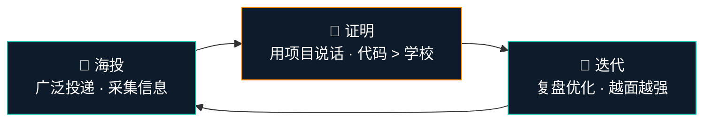

<p align="center">
  
</p>

<div align="center">

# 🚀 实习突围 · Career Breakthrough

### 不靠学校牌子，靠项目说话 — 一个双非大一学生的求职方法论 + 全套工具链

[](LICENSE)
[](https://github.com/Destined-at-Dawn/career-breakthrough/stargazers)
[](https://github.com/Destined-at-Dawn/career-breakthrough/commits/main)
[](https://github.com/Destined-at-Dawn/career-breakthrough/issues)
[](CONTRIBUTING.md)

**海投 → 证明 → 迭代 — 三周，两个 offer。**

[中文](#-中文) · [English](README.en.md) · [Quick Start](#快速开始) · [Templates](#简历模板一览)

</div>

---

## 🇨🇳 中文

### 我是谁

2026 年春天，一个双非大一学生开始找实习。没有 985 光环，没有学长内推，没有任何人脉资源。

**方法很简单：海投 → 用项目证明自己 → 每次面试后复盘迭代。**

三周时间，投了 20+ 家公司，拿到 3-4 个面试机会，最终收获 2 个实习 offer（含 FPGA 应用工程师岗）。朋友圈分享 offer 截图后，很多人来问方法。

这个项目就是回答。

---

### 核心理念



1. **海投** — 不是乱投，是系统性信息采集。每次投递都在了解市场要什么。
2. **证明** — 用代码、波形、项目文档说话，而不是用学校名字。
3. **迭代** — 每次面试都是免费的市场调研。复盘 → 更新简历 → 下次更强。

---

### 这个项目能给你什么

| 类别 | 内容 | 数量 |
|:-----|:-----|:-----|
| 📖 **方法论** | 从海投到拿 offer 的完整心法（来自实战） | 6 篇 |
| 📄 **简历模板** | 中文 + 英文，学生 + 职场，Markdown + 可打印 | 12 种 |
| 🎯 **面试工具** | 准备清单、HR 追问模拟、复盘模板、薪资谈判 | 4 份 |
| 🤖 **AI 辅助** | Claude Code / Gemini 提升求职效率的实操指南 | 3 篇 |
| 📊 **求职流水线** | 企业追踪表、时间线规划、投递状态管理 | 2 份 |
| 🚀 **职场成长** | 实习生生存指南、新人手册、职业规划框架 | 3 篇 |

---

### 快速开始

#### 🎓 学生找实习

```
Step 1 → 读 methodology/01-海投心法.md（理解海投不是乱投）
Step 2 → 选模板 → 按 STAR 法则写简历
Step 3 → 用 pipeline/企业追踪模板.md 跟踪投递状态
Step 4 → 面试前读 interview/面试准备清单.md
Step 5 → 面试后填 interview/面试复盘模板.md
```

#### 💼 职场人士跳槽/转型

```
Step 1 → 读 methodology/03-证明自己.md（用项目和数据说话）
Step 2 → 选 resume/templates/cn/ 职场进阶版
Step 3 → 读 career-growth/薪资谈判指南.md
```

#### 🤖 用 AI 加速

```
Step 1 → 读 ai-tools/AI辅助简历写作.md（AI 出初稿 → 人工去 AI 味 → 迭代）
Step 2 → 用 ai-tools/AI面试模拟.md 做模拟面试
Step 3 → 配合 resume/ai-generation-guide/去AI味指南.md
```

---

### 简历模板一览

<details>
<summary>🇨🇳 中文模板（4 种）</summary>

| 模板 | 适用场景 | 文件 |
|------|---------|------|
| 学生实习·简洁版 | 投递中小企业 | [`cn/学生实习版-简洁.md`](resume/templates/cn/学生实习版-简洁.md) |
| 学生实习·技术深度版 | 技术岗（FPGA/嵌入式/软件） | [`cn/学生实习版-技术深度.md`](resume/templates/cn/学生实习版-技术深度.md) |
| 职场初级版 | 1-3 年经验跳槽 | [`cn/职场初级版.md`](resume/templates/cn/职场初级版.md) |
| 职场进阶版 | 3-5 年经验高级岗 | [`cn/职场进阶版.md`](resume/templates/cn/职场进阶版.md) |

</details>

<details>
<summary>🇺🇸 English Templates (4)</summary>

| Template | Use Case | File |
|----------|----------|------|
| Student Intern · Minimal | Clean & simple | [`en/student-intern-minimal.md`](resume/templates/en/student-intern-minimal.md) |
| Student Intern · Technical | Technical roles | [`en/student-intern-technical.md`](resume/templates/en/student-intern-technical.md) |
| Professional · Junior | 1-3 years exp | [`en/professional-junior.md`](resume/templates/en/professional-junior.md) |
| Professional · Senior | 3-5+ years exp | [`en/professional-senior.md`](resume/templates/en/professional-senior.md) |

</details>

<details>
<summary>📝 Markdown 模板（4 种）</summary>

| 模板 | 文件 |
|------|------|
| 中文·简洁版 | [`markdown/cn/简洁版.md`](resume/templates/markdown/cn/简洁版.md) |
| 中文·技术深度版 | [`markdown/cn/技术深度.md`](resume/templates/markdown/cn/技术深度.md) |
| EN · Minimal | [`markdown/en/minimal.md`](resume/templates/markdown/en/minimal.md) |
| EN · Technical | [`markdown/en/technical.md`](resume/templates/markdown/en/technical.md) |

</details>

---

### 方法论

| # | 文章 | 核心观点 |
|:--|:-----|:---------|
| 01 | [海投心法](methodology/01-海投心法.md) | 海投是信息采集，不是赌博 |
| 02 | [筛选漏斗](methodology/02-筛选漏斗.md) | 用三层漏斗过滤出值得跟进的机会 |
| 03 | [证明自己](methodology/03-证明自己.md) | 项目 > 学校 > GPA，代码说话 |
| 04 | [面试攻略](methodology/04-面试攻略.md) | 面试是双向信息交换 |
| 05 | [复盘迭代](methodology/05-复盘迭代.md) | 每次面试都是免费市场调研 |
| 06 | [职场人脉](methodology/06-职场人脉.md) | 真诚 > 套路 |

---

### 项目结构

<details>
<summary>📂 完整目录树</summary>

```
career-breakthrough/
├── README.md                          # 你正在看的这个文件
├── README.en.md                       # English version
├── FAQ.md                             # 常见问题
├── CONTRIBUTING.md                    # 贡献指南
├── LICENSE                            # MIT License
│
├── methodology/                       # 📖 方法论（6 篇）
│   ├── 01-海投心法.md
│   ├── 02-筛选漏斗.md
│   ├── 03-证明自己.md
│   ├── 04-面试攻略.md
│   ├── 05-复盘迭代.md
│   └── 06-职场人脉.md
│
├── resume/                            # 📄 简历系统
│   ├── templates/                     # 12 种模板（中英 × 多风格）
│   │   ├── cn/                        # 中文模板
│   │   ├── en/                        # 英文模板
│   │   └── markdown/                  # Markdown 在线简历
│   │       ├── cn/
│   │       └── en/
│   ├── examples/                      # 填写好的示例简历
│   └── ai-generation-guide/           # AI 辅助简历写作指南
│       ├── STAR法则.md
│       ├── 去AI味指南.md
│       └── ATS优化指南.md
│
├── interview/                         # 🎯 面试系统
│   ├── 面试准备清单.md
│   ├── HR追问模拟.md
│   ├── 面试复盘模板.md
│   └── 薪资谈判指南.md
│
├── pipeline/                          # 📊 求职流水线
│   ├── 企业追踪模板.md
│   └── 时间线规划.md
│
├── career-growth/                     # 🚀 职场成长
│   ├── 实习生生存指南.md
│   ├── 职场新人手册.md
│   └── 职业规划框架.md
│
├── ai-tools/                          # 🤖 AI 工具指南
│   ├── Claude-Code求职指南.md
│   ├── AI辅助简历写作.md
│   └── AI面试模拟.md
│
├── templates/                         # 📝 通用模板
│   ├── 求职信模板-中文.md
│   ├── 求职信模板-英文.md
│   ├── LinkedIn档案指南.md
│   └── 微信求职话术.md
│
└── community/                         # 👥 社区
    └── success-stories/
        └── template.md
```

</details>

---

### 我的真实数据

| 指标 | 数据 |
|:-----|:-----|
| 学校 | 某双非院校 |
| 年级 | 大一 |
| 专业 | 电子信息类 |
| GPA | 3.8+ / 4.0 |
| 投递数 | 20+ |
| 面试数 | 3-4 |
| Offer 数 | 2 |
| 耗时 | 约 3 周 |
| 核心竞争力 | 手写 FPGA RTL 代码（非 IP 核）+ AI 辅助开发 |

---

### 贡献

欢迎提交 PR！你可以：

- 📄 **添加简历模板** — 新的行业 / 岗位 / 语言版本
- 📝 **分享成功案例** — 匿名化后放入 `community/success-stories/`
- 🔧 **改进方法论** — 补充你的实战经验
- 🐛 **修复错误** — 文档错误、格式问题

详见 [CONTRIBUTING.md](CONTRIBUTING.md)

---

### License

MIT — 随便用，请保留署名。

---

### 致谢

感谢所有在求职路上互相帮助的朋友。你们的每一次内推、每一次指点、每一次面试反馈，都让这个项目变得更好。

**如果你用这个项目拿到了 offer，欢迎提交你的故事到 `community/success-stories/`。**
